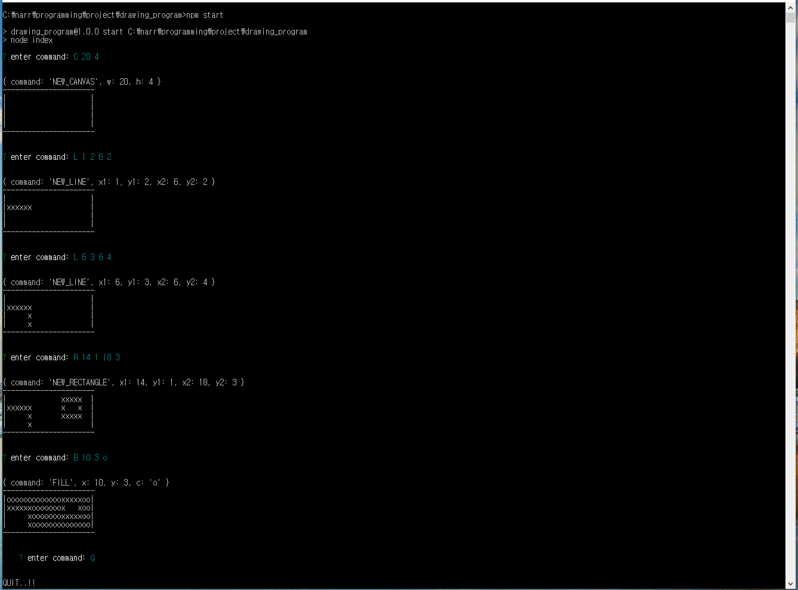
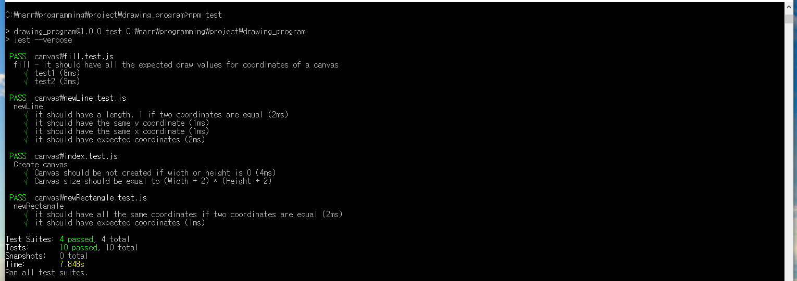
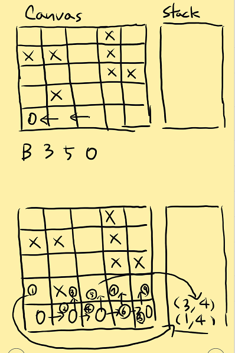

# Drawing Program

## Description

A simple **console** version of a drawing program.

[Support functionality]

1. Create a new canvas
2. Start drawing on the canvas by issuing various commands
3. Quit

## Prerequisites

[Node.js](https://nodejs.org/en/) >= version 6.0

To check if **node** is installed, try a command below

```sh
node -v
-> v6.0.0
```

## How to run

1. Open window **CMD**(cmd.exe)
2. CD to the root path of this project folder
3. Run a command below

```sh
npm install
```

After the above command, execute a commmand like below

### Run the program

```sh
npm start
```



### Run the test cases

```sh
npm test
```



## Used Libraries

* [Inquirer.js](https://github.com/SBoudrias/Inquirer.js) - command line interface for **Node.js**
* [Jest](https://facebook.github.io/jest/) - **Javascript** Test Framework
* [Eslint](https://eslint.org/) - Linting utility for **JavaScript**

## Folder Structure

``` sh
.
├── canvas
│   ├── fill.js // Fill coordinates of Canvas
│   ├── fill.test.js
│   ├── index.js // Create Canvas, Update coordinate in Canvas and Render Canvas
│   ├── index.test.js
│   ├── newLine.js // Get coordinates of new Line
│   ├── newLine.test.js
│   ├── newRectangle.js // Get coordinates of new Rectangle
│   ├── newRectangle.test.js
│
├── constant.js
├── index.js // Statring point of the App and handle commands from CMD
└── validator.js // Validate commands from CMD
```

## Assumptions

1. The command should be exactly matched to be executed.
> e.g. Invalid commands, * means a space
* c\*5\*5 -> no capital letter
* C\*5\*5\* -> ending space
* C\*5\*\*5 -> additional space

2. For color of Fill command, it only allows English alphabet, both small letter and capital letter.

3. It doesn't allow to draw line or reactangle and fill wihtout Canvas.

4. It can draw line or reactangle again in coordinates that are filled with color.

## Explanation of main logics

### Canvas Data

* Canvas is consisted of two dimensional array. The parent array means Y axis value and the child array means X axis. Child array is made up of an object that has a key, draw and fill.

* The key, draw is used to render a line or a rectangle. On the other hand, fill is used to fill color.

```javascript
const canvasData = [
  [{
    draw: draw-value,
    fill: fill-value,
  }]
];
```

### Draw line or rectangle

* When it receives coordinates for line or rectangle, it will calculate required coordinates and return an array that has x, y coordinate array. Next, it will update canvas data with the returned array by matching the coordinates.

### Fill color

#### Find connected and the leftest coordinate from the start position in a row

To handle this fill-color-process in one direction in a row, it searchs for the leftest coordiate from start position firstly.



#### Proceed from the leftest coordinate

1. Fill the color and check if the up coordinate is fillable.
2. If it is, find the leftest coordinate from the up row one and save it in a stack.
3. Do the same thing to the down coordinate.
4. Move to right cooridnate and repeate 1 to 3.
5. When it can't move to right anymore, take out a cooridnate from stack and move to the position.
6. Repeat 1 to 5 until there is no more saved coordiates in a stack.
